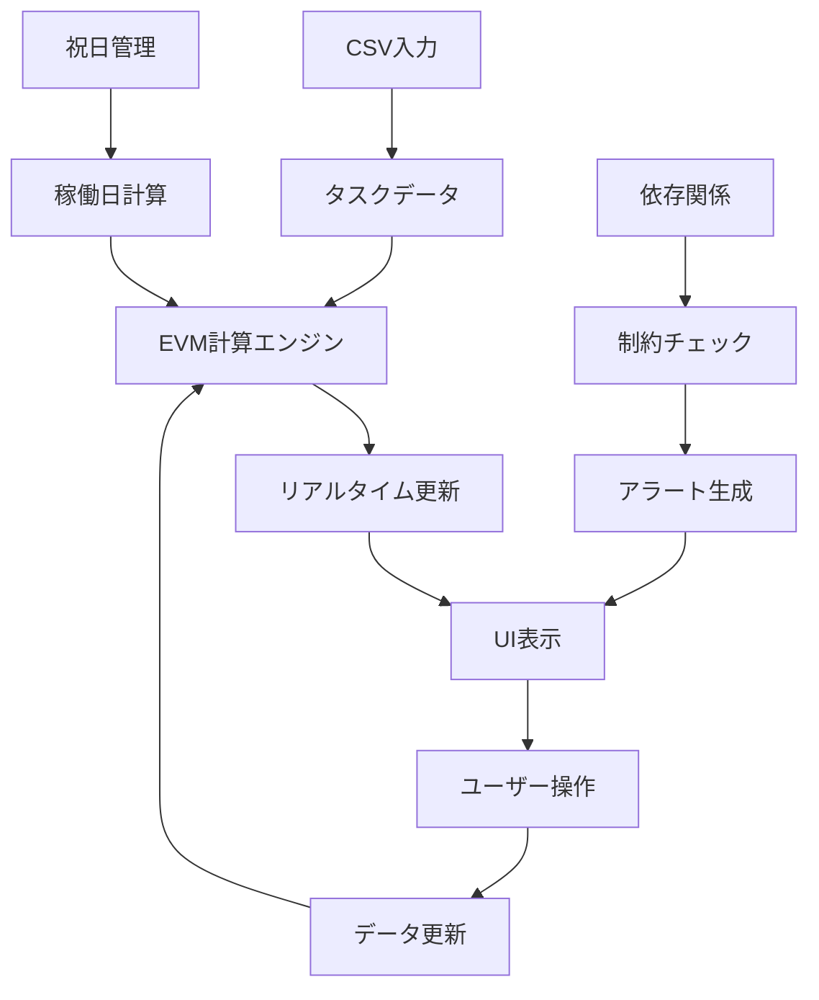

# 建設業向けEVM工程管理ツール - 詳細仕様書 v1.0

## 目次
1. [プロジェクト概要](#1-プロジェクト概要)
2. [アーキテクチャ設計](#2-アーキテクチャ設計)
3. [ガントチャートUI仕様](#3-ガントチャートui仕様)
4. [EVM計算エンジン仕様](#4-evm計算エンジン仕様)
5. [進捗管理システム](#5-進捗管理システム)
6. [祝日・稼働日管理](#6-祝日稼働日管理)
7. [依存関係管理](#7-依存関係管理)
8. [アラートシステム](#8-アラートシステム)
9. [データ仕様](#9-データ仕様)
10. [実装計画](#10-実装計画)

---

## 1. プロジェクト概要

### 1.1 目的
建設業の現場工程管理とEVM（Earned Value Management）を統合し、リアルタイムでの進捗・コスト管理を実現するデスクトップアプリケーション。

### 1.2 対象ユーザー
- 施工管理者
- 現場代理人
- プロジェクトマネージャー

### 1.3 技術スタック
- フロントエンド: React, TypeScript
- デスクトップ: Electron
- テスト: Vitest
- 対象OS: Windows 10/11（プライマリ）

### 1.4 配布形態
- オフライン動作可能なデスクトップアプリ
- 独自ファイルフォーマット
- CSV入出力対応

---

## 2. アーキテクチャ設計

### 2.1 全体構成

```
┌─────────────────────────────────────────────────────────┐
│                    UI Layer (React)                     │
├─────────────────┬─────────────────┬─────────────────────┤
│  工程情報パネル   │   ガントチャート   │    EVM指標パネル    │
│  - 工程編集     │   - 計画バー     │    - リアルタイム   │
│  - 依存関係     │   - 実績バー     │    - アラート      │
│  - 進捗入力     │   - 依存線       │    - ダッシュボード │
└─────────────────┴─────────────────┴─────────────────────┘
┌─────────────────────────────────────────────────────────┐
│                Business Logic Layer                     │
├─────────────────┬─────────────────┬─────────────────────┤
│  EVM計算エンジン │  祝日管理システム │   依存関係エンジン   │
│  - PV/EV/AC     │  - 日本祝日     │   - FS制約         │
│  - SPI/CPI      │  - カスタム祝日  │   - 制約違反検出    │
│  - リアルタイム  │  - 稼働日計算    │   - 自動調整       │
└─────────────────┴─────────────────┴─────────────────────┘
┌─────────────────────────────────────────────────────────┐
│                   Data Layer                           │
├─────────────────┬─────────────────┬─────────────────────┤
│   CSVインポート  │   ファイル管理   │    設定管理         │
│   - パース処理   │   - 保存/読込   │    - アラート設定   │
│   - エラー処理   │   - エクスポート │    - 祝日設定      │
└─────────────────┴─────────────────┴─────────────────────┘
```

### 2.2 データフロー



---

## 3. ガントチャートUI仕様

### 3.1 レイアウト構成

```
┌─────────────────┬─────────────────────────────────────┬──────┐
│  工程情報パネル   │           ガントチャート              │ 操作 │
│ (220px固定)     │                                   │ (30px│
├─────────────────┼─────────────────────────────────────┤ 固定)│
│ ☰ 足場組立      │ 実績■■■■■■ 80%                │ ↕️   │
│ 依存: [1,2]     │ ────→─────────────────────────    │      │
│ 計画: 1/5-1/10  │ 計画████████████                  │      │
│ 実績: 1/7-1/12  │ ↳依存線                           │      │
│ 進捗: [80%]     │                                   │      │
│ 状態: [遅延]    │                                   │      │
├─────────────────┼─────────────────────────────────────┼──────┤
│ 次の工程...     │ 次のタスクのバー...                  │ ↕️   │
└─────────────────┴─────────────────────────────────────┴──────┘
```

### 3.2 工程情報パネル仕様

#### 3.2.1 表示項目
- 工程名, 依存関係, 計画日程, 実績日程, 進捗率, 状態表示

#### 3.2.2 編集制御ルール
```typescript
interface EditRules {
  canEditPlan: boolean;
  canEditActual: boolean;
  reason: string;
}
function getEditRules(task: TaskRow): EditRules { /* ... */ }
```

### 3.3 ガントバー仕様

（色分け・配置・進捗表示・ドラッグ&ドロップ仕様など、依頼文の詳細を反映）

---

## 4. EVM計算エンジン仕様

（EVMMetrics, PV/EV計算, リアルタイム更新のクラス概要など、依頼文の詳細を反映）

---

## 5. 進捗管理システム

（ハイブリッド進捗入力UI/自動計算/差異警告の仕様）

---

## 6. 祝日・稼働日管理

（日本固定祝日・ハッピーマンデー・カスタム祝日と稼働日計算、設定UI）

---

## 7. 依存関係管理

（FS制約、データ構造、視覚表示、制約チェック）

---

## 8. アラートシステム

（閾値設定、評価・通知、表示UI、承認/解除）

---

## 9. データ仕様

（拡張CSV, 内部データ構造, プロジェクトファイル, エクスポート形式）

---

## 10. 実装計画

（4週間スケジュール、品質保証計画、テスト/性能要件、リスク、リリース戦略）

---

## 11. 非機能要件

（性能・可用性・セキュリティ・アクセシビリティ・国際化）

---

## 12. 技術仕様詳細

（アーキパターン、依存性注入、状態管理、永続化、エラーハンドリング）

---

## 13. 運用・保守計画

（配布/アップデート、監視・ログ、ユーザーサポート）

---

## 14. まとめ

本追加仕様書は今月中のv1.0.0リリースを目標とした実装指針です。実装過程での仕様変更や追加要件は、適切なバージョン管理の下で随時更新します。

作成日: 2025-09-07 / バージョン: 1.0 / 作成者: プロジェクト管理AI

